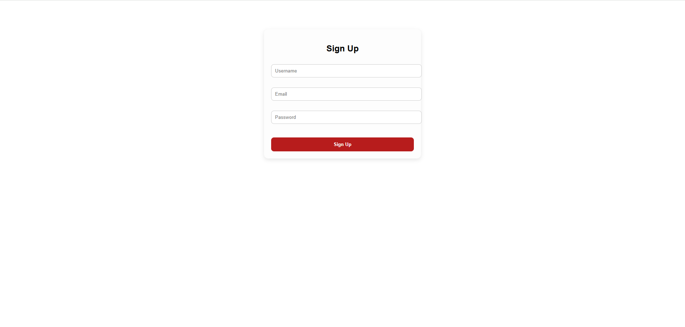
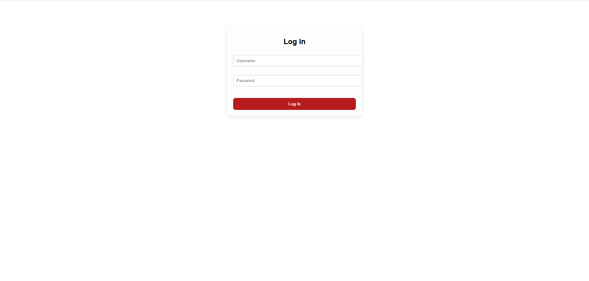

# 🔐 Full Stack Authentication App

This is a simple full-stack authentication project built with **React**, **Node.js**, **Express**, and **MySQL**.  
It allows users to **sign up**, **log in**, and view a protected **profile page** after authentication.

---

## 📂 Tech Stack

- **Frontend:** React, Axios, React Router, Toastify
- **Backend:** Node.js, Express, JWT, bcrypt
- **Database:** MySQL
- **Styling:** Custom CSS

---

## 🚀 Features

- 🔐 User registration with hashed passwords
- 🔑 Login system with JWT authentication
- 🔒 Protected profile route
- ✅ Basic input validation (frontend & backend)
- 🌐 Toast notifications for user feedback

---

## 📸 Screenshots

| Sign Up | Log In | Profile |
|--------|--------|---------|
|  |  |  |

---

## ⚙️ How to Run Locally

### 1. Clone the project

```bash
git clone https://github.com/your-username/fullstack-auth.git
cd fullstack-auth

### 2. Install Backend Dependencies

```bash
cd backend
npm install

### 3. Create a .env file in /backend:
DB_HOST=localhost  
DB_USER=root  
DB_PASSWORD=  
DB_NAME=users_db  
JWT_SECRET=your_jwt_secret  
PORT=3001  

### 4. Start the backend:
npm start

### 5. Install Frontend Dependencies
cd ../frontend
npm install

### 6. Start the React frontend:
npm start

### 🛠️ Folder Structure
fullstack-auth/
├── backend/
│   ├── routes/
│   │   └── auth.js
│   ├── middleware/
│   │   └── authMiddleware.js
│   ├── db.js
│   └── server.js
│
├── frontend/
│   ├── src/
│   │   ├── pages/
│   │   │   ├── Signup.js
│   │   │   ├── Login.js
│   │   │   └── Profile.js
│   │   ├── styles/
│   │   │   └── AuthForm.css
│   │   ├── App.js
│   │   └── index.js
│   └── public/
│
├── screenshots/
│   ├── signup.png
│   ├── login.png
│   └── profile.png
│
├── .env
└── README.md

## 🧠 Notes

- Passwords are hashed using **bcrypt**.  
- JWT tokens are stored in **localStorage**.  
- Requests to `/api/auth/profile` require a valid token.  
- Don’t forget to add **screenshots** if you want them to appear above.

---

## 🙋 Author

Developed by [Alpar Akın](https://github.com/alparAkin)